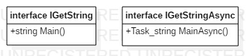
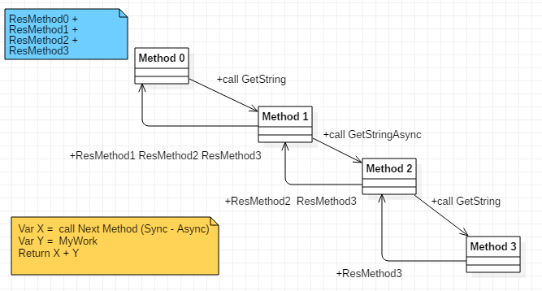

# Qué se va a contemplar

En el siguiente diagrama se tiene una visión global de los casos a tener en cuenta. Posteriormente se ira desglosando por partes para tener para una mejor comprensión de lo que se pretende hacer.

Focalizándonos por partes en los siguientes puntos, se tendrá una mejor visión de lo que se pretende hacer:

## Interfaces IGetString y IGetStringAsync

Las interfaces que vamos a utilizar son las siguientes que se muestran a continuación.

En verdad, para hacer la prueba de concepto, hubiera sido suficiente con la interfaz Asíncrona (IGetStringAsync). En la misma documentación de Microsoft, se dice que en caso de que en el cuerpo de un método Async no contenga ninguna línea con la key wait, se procesaría como si de un método síncrono se tratara.

Por otro lado, la idea de introducir la versión No Asíncrona (IGetString) viene dada por los casos de experiencia profesional donde muchas veces las refactorizaciones de código dejan escenarios donde métodos asíncronos llaman a métodos síncronos y vicecersa, y no se tiene bien definidida una estrategia a seguir.

Además, cuando estamos en un método síncrono que invoca a otro con signatura Síncrona, y para mejorar su performance estamos tentados a implementar un cierto paralelismo utilizando el método GetWaiter de la clase Task y posteriormente el GetResult de ésta,... ¿estaríamos haciéndolo bien?¿Tendría el mismo comportamiendo si esta dentro de una cascada de llamadas Async/Sync ?. Me podrían decir que.. en este caso se podría refactorizar dicho método Síncrono a Asíncrono pero... ¿Y si el método sincrono en cuestión fuera reutilizado en varios contextos de tal mantera que arrastrara una gran regresión en caso de ser refactorizado...?

En fin, para termiinar este apartado decir que ambas interfaces mezcladas o no en una cascada de llamadas, deben devolver el mismo resultado para validar que la implementación total ha sido correcta.

nota: ya sean todas las llamadsa con GetString o con GestStringAsync o mezcladas, el resultado final debe ser el mismo, como se muestra en la figura, en la nota superior-izquierda

## Estrategias de las implementaciones

Teniendo en cuenta que constantement referenciaré a los terminos "Wait first", "Wait After", "Awaiter", "Not Wait" más adelante, aprovecho este apartado para aclarar lo que significa cada cual.

  * Wait first (para contextos async/sync)

    1) llamar al siguiente metodo y esperar su resultado (WAIT)
    2) componer su propia cadena (todo)
    3) concatenar ambas y salir

  * Wait after (para contextos async/sync)

    1) preparar la Task para llamar al siguiente método y empezar su ejecución
    2) componer su propia cadena (MyWork)
    3) esperar a que termine el paso 1)
    4) concatenar ambas cadenas 1) y 3), y salir

  * Awaiter (para contextos async/sync)

    1) preparar la Task con un Awaiter para llamar al siguiente método y empezar su ejecución
    2) componer su propia cadena (MyWork)
    3) esperar a que termine el paso 1)
    4) concatenar ambas cadenas 1) y 3), y salir

  * Not Wait (para contexto async)

    1) preparar la Task para llamar al siguiente método y empezar su ejecución
    2) componer su propia cadena (MyWork)
    3) Sin esperar, obtener la cadena de paso 1)
    4) concatenar ambas cadenas 1) y 3), y salir

## Method, MethodAsync, MethodSync

Las clases Method, MethodAsync y MethodSync representan una abstracción. De MethodAsync derivarán las clases que implementarán IGetStringAsync mientras que de MethodSync derivarán las que implementen  IGetString.

## MethodAsync y derivadas

MethodAsync es una abstracción de la implementación de la interfaz IGetStringAsync

1) MAsyncFinal: implementación concreta y final de la interfaz IGetStringAsync. invocará directamente a su función DoImplementWork la cual al estar en un contexto asíncrono que nos ofrecerá otras posibilidades que más adelante se verá en el apartado DoIdependentWork. 

2) MAsyncWithNext:  abstracción de la interfaz IGetStringAsync con el particular que internamente va a tener un atributo Next de tipo IGetString o IGetStringAsync.

2.1) MACallNextAsync: abstracción de la interfaz IGetStringAsync de quien heredará las impementaciones cuyo Next MEthod es de tipo IGetStringAsync

2.1.1) MACallNextAsyncFirst: Clase concreta que implementa una estrategia WaitFirst definida en el apartado "Estrategias de las implementaciones".

2.1.2) MACallNextAsyncAfter: Clase concreta que implementa una estrategia WaitAfter definida en el apartado "Estrategias de las implementaciones". 

2.1.3) MACallNextNotWait: Clase concreta que no implementa una estrategia con respecto a la key wait. Ademas su implementación levanta WARNINGS en tiempo de compilacion y un resultado NO ESPERADO. Con esta implementación se pretende demostrar los casos en los que una refactorización a medias puede generar errores latentes y un resultado no esperado de su ejecución. 

2.1.4) MACallNextAwaiter: Clase concreta que  implementa una estrategia donde en vez de esperar con un wait, se usa los métodos GetAwaiter de las clases Task y el GetResult de los TaskAwaiter. ¿Estariamos hablando de lo mismo?

Al no usar la key wait dentro de un método Async levanta WARNINGS.

nota: esta implementación ha tenido la dificultad adicional de evitar un Dead-Lock 

2.2) MACallNextSync: Clase concreta que implementando la interfaz IGetStringAsync su siguiente metodo es Sync. 

## MethodSync y derivadas

MethodSync es una abstracción de las implementaciones de la interfaz IGetString.

1) MSyncFinal:  implementación concreta y final de la interfaz IGetString. invocará directamente a su función DoImplementWork la cual al estar en un contexto síncrono tendremos poca variantes para la implementación de DoIdependentWork.

2) MSyncWithNext:  abstracción de la interfaz IGetString con el particular que internamente va a tener un atributo Next de tipo IGetString o IGetStringAsync.

2.1) MSCallNextAsyncWaitFirst: Clase concreta que implementa una estrategia WaitFirst definida en el apartado "Estrategias de las implementaciones".

Como no se puede usar Wait dentro de un método no asíncrono, se ha optado por usar GetWaiter.

2.2) MSCallNextAsyncWaitAfter: Clase concreta que implementa una estrategia WaitAfter definida en el apartado "Estrategias de las implementaciones".

Como no se puede usar Wait dentro de un método no asíncrono, se ha optado por usar GetWaiter.

2.3) MSCallNextSync: Clase concreta que implementando la interfaz IGetString su siguiente metodo es Async. 

## MyWork, DoIndependentWork

La clase MyWork representa a la generación de la cadena del método además de la monitorización.

1) Los parámetros de configuración para la generación de la gráfica y la cadena, se almacenarán en la abstracción MyWork.

2) La estrategia de cómo simular su ejecución, se ejecutará con una de las clases derivadas de TodoStrategy

1) DoIndependentWork

La clase MyWork tendrá una atributo "DoIndependentWork" de tipo TodoStrategy, el cual implementará un texto final además de que generará los puntos para la gráfica que monitorizará la ejecución.

La clase abstracta TodoStrategy contendrá el atributo con la cantidad de pasos o tiempo a simular.

* Clase Looping: implementa la estrategia LOOPING, la cual consiste en una iteracion de N-Steps en las que se generará un Punto en cada uno  de ellas con un descanso de 5 mls. Ademá de generar más puntos, hace un uso más intensivo de la CPU. 

* Clase Sleeping: implementa la estrategia SLEEPING la cual genera dos puntos. Uno al comienzo y el otro despues del intervalo de tiempo ( x Factor de tiempo) definido por el usuario. Esta implementación hace un uso menos intensivo de la CPU.

2) MyWorkAsync es una abstracción de las implementaciones concretas de los Métodos que implementan la interfaz IGetStringAsync. Tendrá un método asíncrono GetStringAsync para poder probar todas las combinaciones que nos ofrece el método asíncrono. 

2.1) MWWait: clase que invocará un wait sobre una envoltura con una instancia de Task a la invocación de la función doIndependentWork 

2.2) MWAwaiter: clase que invocará un GetWaiter sobre una envoltura con una instancia de Task a la invocación de la función doIndependentWork 

2.3) MWNotWait: clase que no invocará ni a wait ni a awaiter, siendo su ejecución síncrona pese a su signatura y además, el compilador genera un WARNING.

3) MyWorkSync es una implementación concreta síncrona y será invocada por las implementaciones derivadas de MethodSync. Ofrecrea un método GetString síncrono y por lo tanto pocas combinaciones, por lo cual es una clase concreta.

