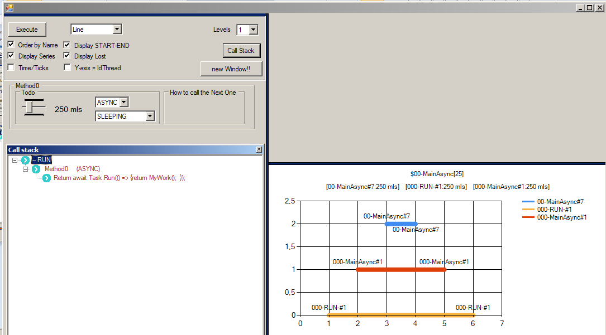

# Visión General

visión global de la aplicación.

La aplicación tiene dos partes

    1) Configuración

        Superior o configuración general

        Inferior/Central o configuración por métodos

    2) Resultados de la Configuración.

        Gráfica que monitoriza el resultado de la ejecución

        Call Stack

## 1. Configuración general

En este apartado se describen las opciones que se puden configurar a alto nivel.

1) Execute: botón de ejecución del escenario configurado en ese momento.

2) Point o Linear: tipo de gráfica

  * Pintará una Linea que comunica el primer y último punto de una serie.

  * Pintará una sucesión de puntos por series. Cuando hay estrategias SLEEPING, se suele pintar sólo dos puntos. En este caso se visualiza mejor la serie como una recta. 

3) Levels: el número de métodos o (niveles)
  
  Genera tantos métodos como Level seleccionado.

4) Order by name

Las series serán mostradas por su identificador si esta activo o por orden de aparición. La segunda opción dificulta su interpretación.
  
Las series se identificaran: 

  * Puntos generados por el Método al empezar y al terminal el método: empieza por 00 + Level del método
    
  * Puntos generados por el Método en su DoIndependentWork= empieza por 0 + Level del método

  * Puntos que representa el comienzo y final de la ejecución.

  * Puntos LOST de una serie: intenta representar la relación entre DoIndependentWork y el tiempo o puntos transcurrido hasta que su siguiente método termina de generar su cadena. 
  
  nota: En la prueba de concepto, se está devolviendo una cadena y por eso se intuye su espera, pero ¿y en los casos de no hacerse? ¿se perderían esos puntos pendientes de ejecutar?  

5) Display/Series:

Muestra el punto inicial y final de la serie representada.

6) Time/Ticks

Cuando esta marcada la opción se muesra en el eje X el tiempo. Esto hace que se vea mejor la proporcionalidad temporal cuando las series tienen una estrategia de Sleeping. Luego el valor mostrado es lo de menos. 

7) Display Lost

Muestra o oculta los puntos de pérdidos. Cuando la gráfica es lineal, se pintará una línea vertical.

8) Display Y-Axis = Id Thread

Representa las series siendo el eje Y el id del hilo.

9) Call Stack, representa en pseudocódigo del escenario que se está ejecutando.

10) new Window!!: lanza una ventana clonada.

# 2. Configuración por Metodos

En este apartado se presentan las opciones que se puede configurar por cada método.

1) Nombre del método : method + Level

2) Type of impl. Tipo de implementación SYNC o ASYNC

3) DoIndependentWork : este área configura el comportamiento del método para crear su resultado y los puntos generados en la gráfica.

  3.1) LOOPING o SLEEPING

  3.2) Cantidad de Steps (x1) o mls (x 10)

  3.3) Estrategia dependiendo del Type of iml. elegido en el método

    NORMAL ( ASYNC/SYNC )
    WRAPPER_ASYNC ( ASYNC ) 
    WRAPPER_ASYNC_AWAITER ( ASYNC )

4) Call to Method

Condigura la estrategia de como llamar al siguiente Method dependiendo del Type of iml. elegido en el método

  * WAIT FIRST ( ASYNC/SYNC )
  * WAIT AFTER ( ASYNC/SYNC )
  * AWAITER AFTER ( ASYNC )
  * NOT WAIT ( ASYNC )
    
Si el método es final, este parámetro no procede.

# 3. Call Stack

La pila de llamada, es una ventana que se lanza al pulsar un botón para tal propósito en el área de configuración General.

En el ejemplo de la figura se muestra, se puede apreciar que para los dos métodos de la parte izquierda, como sería el pseudo algoritmo que se va a ejecutar. 

# 4.  Monitorizar Ejecución e iterpretación

Como se ha indicado, en la parte derecha se muestra el resultado de la ejecución en una gráfica.

En la gráfica independiente de la configuración, se va a mostrar dos cabeceras.

1) cabecera con el resultado de la cadena del Metodo 1
2) cabecera con el resultado por cada serie, indicando el tiempo consumido
3) la Grafica representando la ejecución
4) la leyenda de la gráfica

nota: en las series, el número a la derecha de # es el hilo.

* Sleeping

En la figura anterior, se muestra un método que se ha configurado como Sleeping de 250 mls. El resultado se ha configurado como Line (pues la estrategia Sleeping genera una grádica de 2 puntos, y la lineal nos ofrece una mejor manera para interpretarla) 

* Looping

En la figura anterior se muestra la ejecución de un método configurado como un Looping de 25 steps y se ha decidido mostrar con una gráfica por Puntos.

Como se puede apreciar, se ha pintado una serie con un punto por cada paso ( esto es 25 ).

# 5. Interpretando un escenario de tres niveles

En la siguiente figura, se va simular una cascada de tres métodos.

Método 1) implementacion Async, que genera una cadena con un Looping de 25 steps que se ejecuta Asyncronamente tb ( WRAPPPER_ASYNC ). Por la manera en que llamará al método 2, la idea es buscar el paralelismo entre ambas ejecuciones.

Método 2) implementacion Async, que genera una cadena con un Looping de 25 steps que se ejecuta Asyncronamente tb ( WRAPPPER_ASYNC ). Por la manera en que llamará al método 2, la idea es buscar el paralelismo entre ambas ejecuciones.

Método 3) implementacion Async, que genera una cadena con un Looping de 65 steps que se ejecuta Syncronamente o NORMAL ( NORMAL )

Como se puede apreciar en la figura anterior, se ha intentado vincular la configuración en la parte izquierda con la interpretación del resultado de su ejecución en la parte derecha y con su porcion de código en la Call Stack.

* Interpretemos que ha pasado en la ejecución...

1) Relativo a la cabecera de Resultados

La cabecera del resultado, nos indica que no ha habido nada raro.

    $01Main Method1[25]$02Main Method2[25]$03Main Method3[65]

Este resultado es coherente con la configuración descrita arriba ( y mostrada en la imagen en cuestión)

2) Relativo a la segunda cabecera

En esta cabecera, se muestra los tiempos por serie. En otros escenarios su resultado puede ser más interesante.

3) Relativo a la gráfica

En el apartado "Configuración general" se describen los tipos de series que se muestran en este area.

Lo primero de todo, como mínimo deben de haber 115 puntos = 25 del Metodo1 + 25 del Método 2 + 65 del Metodo3, tal como se han descrito en el escenario.

El método 3 (en azul) fue llamado de manera asíncrona, pero resulta que su cadena fue generada por un bucle de 25 pasos de manera síncrona. Este método no se ha paralelizado con nadie y por eso aparece casi como una línea perfecta. Fue atendida por el hilo 1.

Cuando terminó la ejecución del Método1, se han ejecutado en paralelo los métodos 2 y 1.

Se puede apreciar como dichos métodos, se han paralelizado pues ademas de ser asíncronos sus cadenas respectivas generadas en 25 steps cada una se han intercalado entre ellas.

# 6. Interpretando la serie Lost

En estas series que se muestran a continuación, nos focalizamos en las que son de tipo Lost.

En un escenario totalmente asíncrono como en el del ejemplo,varias ejecuciones seguidas rarameente mostrarán el mismo resultado en cuanto ejecución pero si en cuanto a la cadena final mostrada como "Cabecera 1". De no ser así, esto último, estaríamos ante un fallo de implementación.

Pero en lo relativo al orden de ejecución de los pasos, como podemos apreciar en las siguientes capturas como resultado de la ejecución de dos veces el mismo escenario.. el orden de ejecución de los pasos, su intercalación, la predicción de qué método acabará antes que el otro, etc.. cambia.

En estas dos gráficas, se ha optado por una representación lineal ya que nos ayuda a ver mejor las series Lost pintadas como líneas verticales.

Esto nos ayuda a interpretar visualmente los puntos que se perderían y que están a la derecha de la serie Lost del método1 (la llamada 001MainAsync Method1LOST).  También se puede ver que pasaría lo mismo entre la serie Lost del método 2 y los puntos de la serie 3 por procesar.

Además, en lo relativo a las series 1 y 3, se puede ver como las ejecuciones de los métodos 1 y 3 cambian totalmente de orden.

La siguiente gráfica corresponde a la versión por Puntos de la ejecución 2, en donde las series Lost cuestan más de identificarse.

