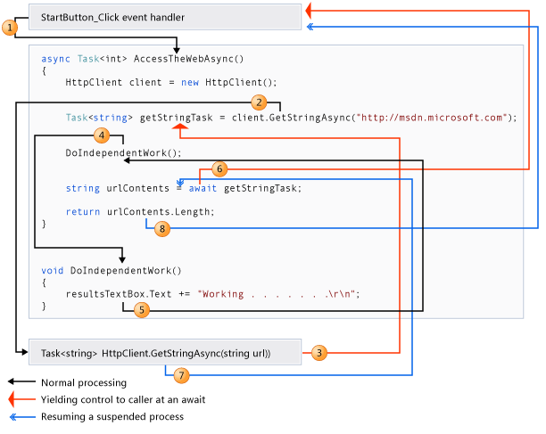
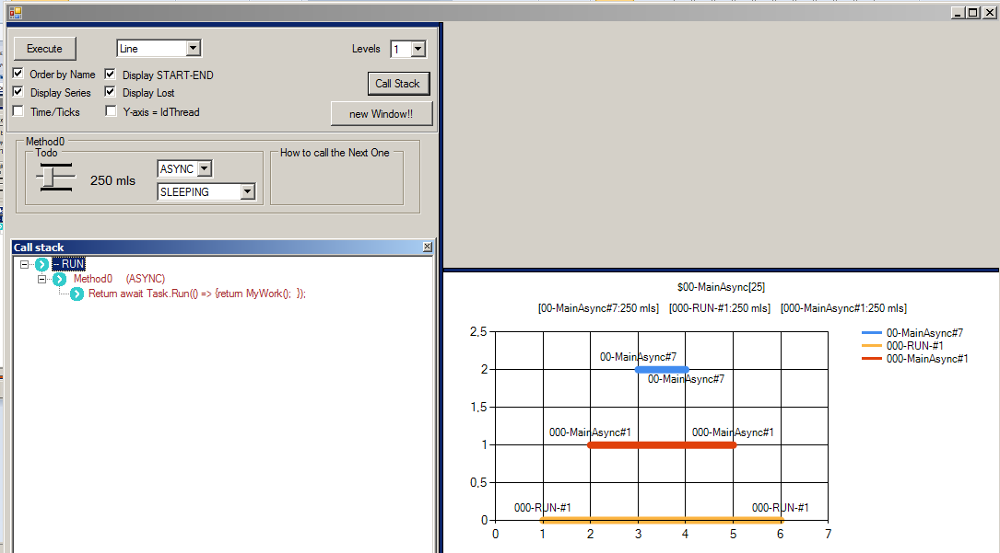
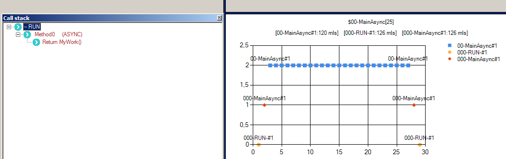
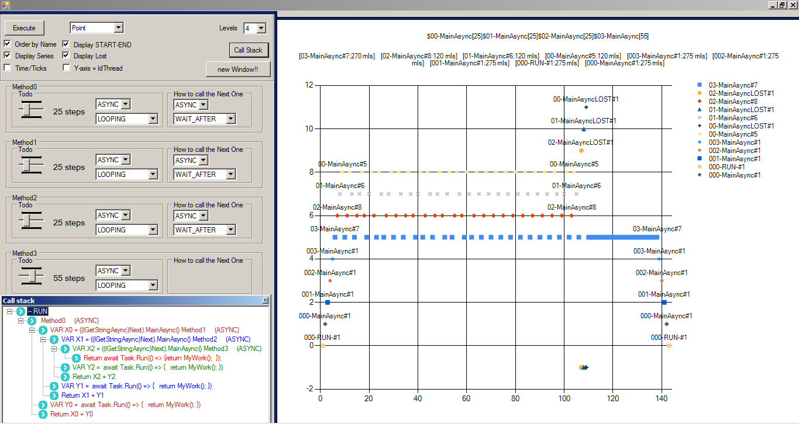

# ProofOfConcept reagarding to Async/Await

# Proof Of Concept: Async/Await

Basado en el artículo relativo a Asyn/Await de microsoft (https://docs.microsoft.com/es-es/dotnet/csharp/programming-guide/concepts/async/ ) uno encuentra esta imagen en el mismo, en el cual ilustra de alguna manera cómo funciona.

Por otro lado, en un proyecto en el que estuve trabajando, vi que se utilizaba en unos contextos un tanto dispares, por lo cual viendo que me aclaraba decidí hacer esta prueba de concepto. 

La idea es definir una cascada de llamadas entre métodos que devuelven una cadena de texto. Habrá dos versiones, una sync y otra async

* string GetString()
* string GetStringAsync()

## Se va a poder definir ##

1) el número de métodos o (niveles)

2) elegir entre la signatura sync o async del metodo

3) el comportamiento del método

* número de pasos o milisegundos, en función de si se elige Looping o Sleeping

* uso no intensivo (sleeping de 250 mls) 

* uso intensivo (Looping de 25 pasos con un descanso de 5 mls entre cada paso)  

4) se va a poder definir cómo se va llamar al siguiente método siguiendo estas estratedgias

  * Wait first (para async/sync)

    1) llamar al siguiente metodo y esperar su resultado (WAIT)
    2) componer su propia cadena (todo)
    3) concatenar ambas y salir

  * Wait after (para async/sync)

    1) preparar la Task para llamar al siguiente método y empezar su ejecución
    2) componer su propia cadena (MyWork)
    3) esperar a que termine el paso 1)
    4) concatenar ambas cadenas 1) y 3), y salir

  * Awaiter (para async)

    1) preparar la Task con un Awaiter para llamar al siguiente método y empezar su ejecución
    2) componer su propia cadena (MyWork)
    3) esperar a que termine el paso 1)
    4) concatenar ambas cadenas 1) y 3), y salir

  * No Wait (para async)
    1) preparar la Task para llamar al siguiente método y empezar su ejecución
    2) componer su propia cadena (MyWork)
    3) Sin esperar, obtener la cadena de paso 1)
    4) concatenar ambas cadenas 1) y 3), y salir

  nota: Si no usamos la key await dentro de un método con signatura async, el compilador lanza un Warning ( esto ocurrira en las estrategias Awaiter y no Wait)

Continuara..

