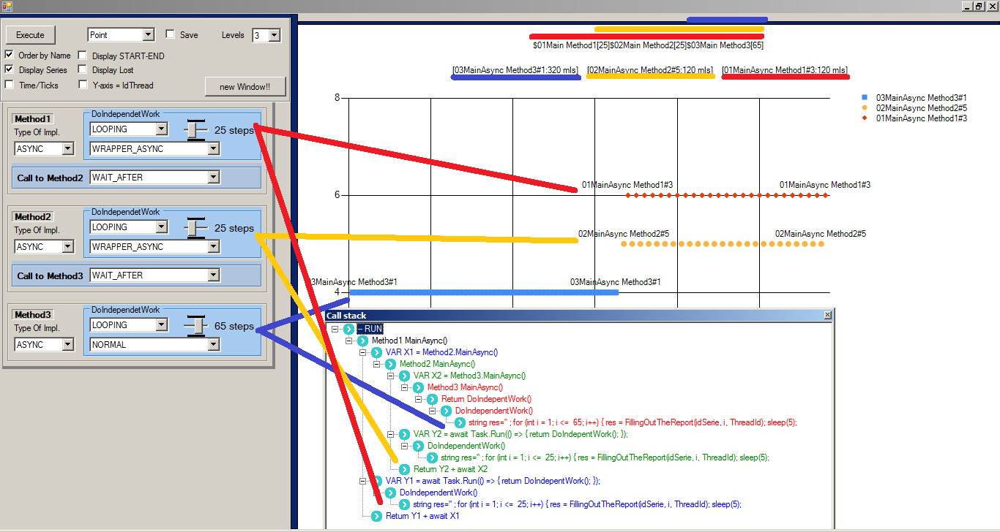

# Async/Await/GetAwaiter

[Basado en el artículo relativo a Asyn/Await de microsoft ](https://docs.microsoft.com/es-es/dotnet/csharp/programming-guide/concepts/async/)
uno encuentra este esquema donde se ilustra 
cómo funciona las keys Async y Wait.

Podemos ver que se ejecuta dentro de un método 'async' para acceder asincronamente al contenido de una URL por http. Los siguientes pasos se ejecutan durante su ejecución:

1) la descarga de una pagina por http. Aunque el método es Async, la key wait no se coloca en dicha línea.

2) Esto hace que la ejecución se haga en paralelo de un trabajo "DoIndependentWork()" 

3) Luego se hace una espera usando la key 'wait' sobre la task creada para la descarga.

4) una vez la task es completada, se devuelve el tamaño de la página.

# Y las dudas surgieron..

Siguiendo ese esquema, surgieron dudas como:

¿cómo es realmente su performance?
¿Cúantos hilos?¿Cómo avanza la ejecución del DoIndependentWork con respecto a la descarga de la página web?

¿cómo seria el performance si usamos el GetAwaiter y/o GetResult de la clase Task en vez de usar la key 'wait'?

En el ejemplo entendí que habia cierto avance en paralelo entre la descarga web y el DoIndependentWork, pero..  cuando éste termina y  se hace la espera de la task ¿ el invocante del método AccessTheWebAsync también estaría progresando por dicho wait?

¿Puede haber deadlock en algún contexto si se mezclan llamas con wait y otras con GetAwaiter?

Entonces,.. antes estas dudas y otras que han ido surgiendo.. implementé esta aplicación a modo de prueba de concepto. 

# ¿En que consiste la prueba de concepto?

En el ejemplo de Microsoft,.. tenemos las siguientes funciones...

## Rol de GetStringAsync ##

Este procedimiento asíncrono se invoca 
de tal manera que no haya bloqueo sobre el hilo invocante, el cual en vez de esto, facilita el progreso de la ejecución del método DoIndependentWork.

En la prueba de concepto se va a sustituir por la llamada a un método asyncrono (o su versión no asyncrona si procede), el cual deberá devolver una cadena de texto. Para que dicha llamada asíncrona tuviera más sentido, se introducirán los elementos necesarios para provocar un efecto "bloqueo" que haga que avance de los DoIndependentWork

1) GetStringAsync()

2) GetString()

## Rol de DoIndependentWork ##

Cada método compondrá su propia cadena. 

La idea es ver como impacta al performance de los async en los casos que:

1) si se hace un uso más o menos intensivo de la CPU

2) si se hace de manera Async o no

Durante la creación de la cadena, se van a generar los puntos de las series que más adelante se mostraran en la gráfica.

Dependiendo de la combinación de los puntos 1) y 2) la concurrencia la gráfica final estará mezclada en mayor o menor medida.

Por eso, la gráfica será tratada como un recurso compartido, serializando su acceso a ella.  

## Resumiendo.. ##

La aplicación definirá una cascada de métodos  de varios niveles.

Se podrá elegir por cada nivel o método, 

1) Si va a ser implementado con Async o no

2) Número de iteraciones o milisegundos a simular dependiendo si se elige Looping o Sleeping

3) Ejecución Async o no, del punto 2)

4) Como se llamará al siguiente Método

Cuando un método termine completamente su ejecución (Rol de DoIndependentWork), va a devolver a su invocante lo generado por él mismo más lo generado por lo que su siguiente generó, como ilustra la imagen siguiente.

 

1) El resultado final debe ser predicible,  para así validar si funciona correctamente la combinación de implementaciones.

2) Por otro lado, nos mostrará el tiempo tardado

3) Se podrá visualizar el algoritmo que implementa dicha cascada definida por el usuario.

4) Se visualizará el orden en que se crearon los puntos

La siguiente imagen es una muestra de lo que se pretende monitorizar con la aplicación.

En la captura podemos ver como:

1) configuracion de la prueba en la parte superior izquierda

1.1) al elegir el número de niveles, se generan tantos niveles como el parámetro Levels es indicado ( en este caso 3)

1.2) se ha indicado que se muestre el nombre de la serie sobre la gráfica

3) los métodos generados en la parte inferior/central izquierda configura los métodos.

 3.1)  Tipo de implementación: Async o Sync 

 3.2) LOOPING de 25 o 65, indica que son iteraciones

 3.3) WRAPPER_ASYNC, indica que el Loopingse hace de manera asíncrono para los médodos 1 y 2. Para el método 3, se hace una iteración Normal.

 3.4)  WAIT_AFTER, es el modo que los Métodos 1 y 2, hacen su llamada asíncrona a sus respectivos siguientes. Más detalles, hacer click en los detalles de implementación.

4) La gráfica mostrada es por puntos. Se puede apreciar como los puntos del método 1 y 2 se intercalaron en la ejecución, mientras que los del método 3 no. Esto tiene su explicación.

# Para más detalles de ..

hacer click Aquí.. [Para saber más detalles de implementacion](HowToGraphicSeriesAreDone.md)

hacer click Aquí.. [Para saber más detalles de la aplicación](HowToWork.md)

hacer click Aquí.. [Conclusiones..](Conclusions.md)

