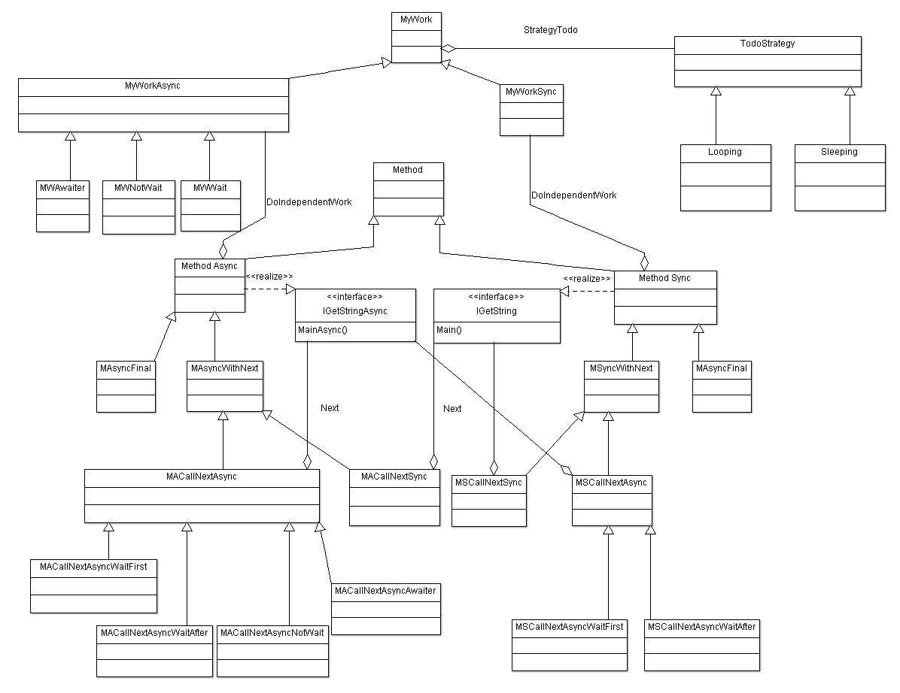

# Async/Await

Basado en el artículo relativo a Asyn/Await de microsoft (https://docs.microsoft.com/es-es/dotnet/csharp/programming-guide/concepts/async/ ) uno encuentra este esquema en el mismo, donde se ilustra cómo funciona.

Siguiendo ese esquema, me surgió la curiosidad profesional de saber cómo es su performance.

La idea era definir una cascada de llamadas entre métodos que van a componer una cadena como resultado. de la conctenación de la invocación de su siguiente y la generada en el mismo método.

Las interfaces son las siguientes que se muestran en la siguiente figura.

Entonces en dicha cascada nos encontraremos varias combinaciones de implementaciones de estas interfaces, resultando que:

* Metodos Async llamaran a un metodo Sync
  * Con Warnings dados por Visual Studio
  * Sin Warnings
* Metodos Sync llamaran a un metodo Async

nota: de aqui surgió la necesidad de simular casos como... ¿Que pasaría si el metodo invocado termina antes que el invocado en un escenario de cascadas de llamadas async? 

En el siguiente diagrama de clases se tiene una visión global de lo que se prentende hacer en esta prueba de  concepto.

Focalizándonos en las clases abstractas, tendremos que:

1) Method: es una abstracción de las dos implementaciones
2) MyWork definirá como el método en cuestión hará o simulará su cadena
3) Call Next Async y Call Next Sync definiran la relación la relación del método con su siguiente

En la siguiente captura, se tendrá una idea de como se podría definir los escenarios en el panel de la izquierda.

En la parte derecha se tiene una representación gráfica del resultado generado en dicho escenario

## Escenarios:Se va a poder definir ##

1) el número de métodos o (niveles)

2) elegir entre la signatura sync o async del metodo

3) el comportamiento del método

* número de pasos o milisegundos, en función de si se elige Looping o Sleeping

* uso no intensivo (sleeping de 250 mls en la captura) 

* uso intensivo (Looping de 25 pasos con un descanso de 5 mls entre paso y paso)  

4) se va a poder definir cómo se va llamar al siguiente método siguiendo estas estratedgias

  * Wait first (para async/sync)

    1) llamar al siguiente metodo y esperar su resultado (WAIT)
    2) componer su propia cadena (todo)
    3) concatenar ambas y salir

  * Wait after (para async/sync)

    1) preparar la Task para llamar al siguiente método y empezar su ejecución
    2) componer su propia cadena (MyWork)
    3) esperar a que termine el paso 1)
    4) concatenar ambas cadenas 1) y 3), y salir

  * Awaiter (para async)

    1) preparar la Task con un Awaiter para llamar al siguiente método y empezar su ejecución
    2) componer su propia cadena (MyWork)
    3) esperar a que termine el paso 1)
    4) concatenar ambas cadenas 1) y 3), y salir

  * Not Wait (para async)
    1) preparar la Task para llamar al siguiente método y empezar su ejecución
    2) componer su propia cadena (MyWork)
    3) Sin esperar, obtener la cadena de paso 1)
    4) concatenar ambas cadenas 1) y 3), y salir

  nota1: Si no usamos la key await dentro de un método con su firma async, el compilador de Visual Studio lanza un Warning informando sobre tal circunstancia( esto ocurrira en las estrategias Awaiter y no Wait)

  nota2: En lo relativo a "Not Wait", se ha introducido esta estrategia para intentar tner en cuanta esos casos en los que las refactorizaciones de código hacen que esta circusntancias pasen, y el compilador aunque lance un aviso de WARNING son ignoradas por los desarrolladores. Es cierto, que en el artículo referido anteriormente dice que en caso de no encontrarse un await el comportamiento se hace Sincrono, pero también es cierto que el resultado en ciertos contextos puede dejar latente un error difícil de detectar.

